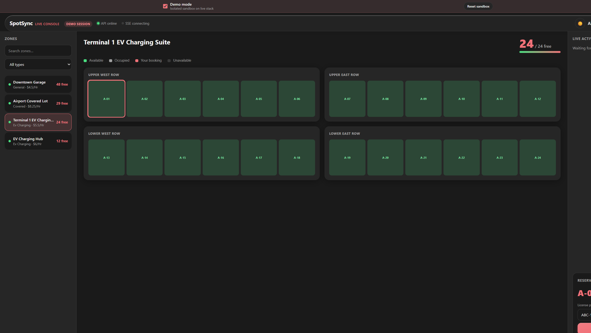
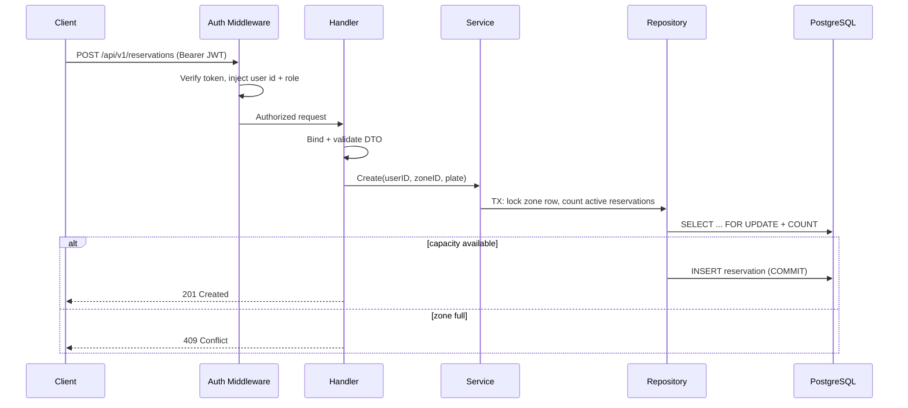

# SpotSync

> A **high-concurrency reservation engine** for finite parking and EV-charging resources — built in Go to **never oversell** a zone, even when hundreds of requests race for the last spot at the same instant.

[](https://go.dev)
[](https://echo.labstack.com)
[](https://neon.tech)
[](https://spotsync-ei6g.onrender.com/healthz)
[](./LICENSE)

**Live API → [spotsync-ei6g.onrender.com](https://spotsync-ei6g.onrender.com/healthz)** · **Live product → [spotsync-nu.vercel.app](https://spotsync-nu.vercel.app)**

```bash
curl https://spotsync-ei6g.onrender.com/healthz   # → {"status":"ok"}
```

> Free-tier Render sleeps after inactivity — the first request may take ~30 s to wake the service.

---

## Table of contents

- [What is SpotSync? (non-technical)](#what-is-spotsync-non-technical)
- [The live product](#the-live-product)
- [The SpotSync stack](#the-spotsync-stack)
- [The core engineering problem](#the-core-engineering-problem)
- [Features](#features)
- [Tech stack](#tech-stack)
- [Architecture](#architecture)
- [Project structure](#project-structure)
- [Getting started](#getting-started)
- [Configuration](#configuration)
- [API reference](#api-reference)
- [Testing](#testing)
- [Deployment](#deployment)
- [Capabilities](#capabilities)
- [License](#license)

---

## What is SpotSync? (non-technical)

Imagine a parking garage with exactly **one** EV-charging spot left, and **fifty** drivers tapping "Book now" at the same second. A naively built system tells several of them "you got it" — and now the garage has promised one spot to many cars.

SpotSync is the backend service that makes that impossible. It is the **source of truth for parking inventory**: it registers users, lets operators publish garages ("zones"), and processes every booking through a path that is mathematically guaranteed to respect capacity. Whatever the traffic, *active reservations never exceed total spots* — this is proven by automated stress tests, not just assumed.

On top of that core, SpotSync powers a full marketplace: organizations apply and get approved, drivers pay before they reserve, availability streams to browsers in real time, and admins monitor everything through health and metrics endpoints.

---

## The live product

This engine powers a complete parking marketplace you can use right now at **[spotsync-nu.vercel.app](https://spotsync-nu.vercel.app)** — demo personas, Stripe test checkout, and a sandboxed demo mode are all available from the landing page.

**Landing page** — live marketplace stats fed by this API:


**Driver map** — per-stall booking grid; occupancy comes from `GET /zones/:id/spots`:


**Live operations console** — three columns kept in sync by this engine's SSE stream:



---

## The SpotSync stack

SpotSync is a four-service system. This repo is the reservation engine; the other services live in sibling repos:

| Service | Role | Repository | Live URL |
| --- | --- | --- | --- |
| **Go API** (this repo) | Reservation engine — auth, zones, capacity invariant, SSE | [SpotSync](https://github.com/rayeemomayeer/SpotSync) | [spotsync-ei6g.onrender.com](https://spotsync-ei6g.onrender.com/healthz) |
| **Web** | Next.js UI for drivers, orgs, platform admins | [spotsync-web](https://github.com/rayeemomayeer/spotsync-web) | [spotsync-nu.vercel.app](https://spotsync-nu.vercel.app) |
| **BFF** | Express gateway — Better Auth sessions, Stripe checkout, API proxy | [spotsync-bff](https://github.com/rayeemomayeer/spotsync-bff) | [spotsync-bff.onrender.com](https://spotsync-bff.onrender.com/healthz) |
| **Notify** | Email receipts & auth mail via Resend | [spotsync-notify](https://github.com/rayeemomayeer/spotsync-notify) | internal (Render) |

---

## The core engineering problem

If `total_capacity` is 1 and one reservation is active, the next request must be rejected. But two *simultaneous* requests can both read "0 active" and both succeed — unless the check-and-insert is serialized.

SpotSync's reservation path opens a database transaction, locks the zone row (`SELECT … FOR UPDATE`), counts active reservations, and inserts only when `active < total_capacity`. Concurrent reservers for the same zone queue behind the lock; the loser of the race gets a clean `409 Conflict`.

This is not asserted — it is **proven**: a stampede test fires 50 concurrent goroutines at a 1-capacity zone and requires exactly one success. Per-stall races (30 workers targeting one `spot_id`) are covered the same way. Three interchangeable capacity strategies exist (`row_lock`, `optimistic`, `redis_counter`) so the trade-offs can be benchmarked under load.

---

## Features

- **JWT authentication** — registration + login with bcrypt-hashed passwords (cost 12).
- **Role-based access control** — `driver` and `admin` roles enforced via middleware; marketplace adds `org_admin` and `saas_admin`.
- **Parking zone management** — admins create zones (`general`, `ev_charging`, `covered`) with capacity and hourly pricing.
- **Dynamic availability** — `available_spots = total_capacity − active reservations`, computed on every read, never stored stale.
- **Concurrency-safe reservations** — transactional row-locked booking path; over-capacity attempts return `409 Conflict`.
- **Bookable parking spots** — per-zone stalls with map coordinates (`pos_x`/`pos_y`); optional `spot_id` targeting; a partial unique index prevents two active bookings on the same stall.
- **Real-time SSE** — `GET /zones/stream` (all zones) and `GET /zones/:id/events` (per zone); Redis pub/sub fans events out across replicas.
- **Transactional outbox + worker** — reservation events are written atomically with the booking and relayed by a separate worker process (with dead-lettering).
- **Redis cache-aside** — zone availability counts cached when `REDIS_URL` is set; invalidated on reserve/cancel.
- **Marketplace layer** — organizations, self-apply → approval flow, org-scoped zones, billing plan gates.
- **Demo reservation TTL** — `X-Demo-Reservation: true` auto-expires showcase bookings (lazy cleanup on reads) so the public demo stays clean.
- **Ownership-scoped actions** — drivers cancel only their own reservations; admins list all.
- **Consistent API contract** — `{success, message, data}` / `{success, message, errors}` envelope on every response; field-level validation errors; raw driver/ORM errors never leak.
- **Operational endpoints** — `/healthz`, `/readyz`, Prometheus `/metrics`, structured `slog` logging with request IDs, explicit CORS, rate-limited `/auth/*`.

---

## Tech stack

| Layer | Choice |
| --- | --- |
| Language | Go 1.25+ |
| HTTP | [Echo v4](https://echo.labstack.com/) |
| ORM | [GORM](https://gorm.io/) (PostgreSQL driver) |
| Database | PostgreSQL — [Neon](https://neon.tech/) in production |
| Validation | [go-playground/validator/v10](https://github.com/go-playground/validator) |
| Auth | [golang-jwt/jwt/v5](https://github.com/golang-jwt/jwt) + bcrypt |
| Migrations | [golang-migrate](https://github.com/golang-migrate/migrate) (versioned SQL, embedded at build) |
| Cache / pub-sub | Redis — [Upstash](https://upstash.com/) in production (optional) |
| Observability | Prometheus metrics, structured `slog`, optional OpenTelemetry |
| Load testing | [k6](https://k6.io/) with thresholds |
| Deploy | [Render](https://render.com/) — Docker web service + background worker |

---

## Architecture

SpotSync follows **Clean Architecture**. Dependencies point inward; handlers never touch GORM models directly — DTOs cross the wire, repositories own persistence, services own business rules and the capacity invariant. Wiring is manual dependency injection in `internal/app`.

```
┌──────────────────────────────────────────────────────────────┐
│  Handler     HTTP only — bind/validate DTOs, call services,  │
│              write JSON envelope responses.                   │
├──────────────────────────────────────────────────────────────┤
│  Middleware  JWT verification, RBAC, request ID, CORS,       │
│              rate limiting on /auth/*.                        │
├──────────────────────────────────────────────────────────────┤
│  Service     Business logic — auth, zones, capacity rules.   │
│              Orchestrates repositories; owns invariants.      │
├──────────────────────────────────────────────────────────────┤
│  Repository  GORM queries, transactions, row locks.           │
├──────────────────────────────────────────────────────────────┤
│  Models/DTO  GORM structs (DB) and request/response DTOs.    │
└──────────────────────────────────────────────────────────────┘
```

**Request lifecycle (reservation):**



### Data model

| Table | Key fields |
| --- | --- |
| `users` | `email` (unique), bcrypt `password`, `role` (`driver` \| `admin`) |
| `parking_zones` | `type`, `total_capacity`, `price_per_hour` |
| `reservations` | `user_id`, `zone_id`, `license_plate`, `status` (`active` \| `cancelled` \| `completed`) |

Availability is derived, not stored: `available_spots = total_capacity − count(active reservations)`.

---

## Project structure

```
cmd/api/              API entrypoint
cmd/seed/             Admin bootstrap seed
internal/
  app/                Echo wiring (manual DI)
  config/             Environment loading
  dto/                Request/response DTOs
  handler/            HTTP handlers
  service/            Business logic
  repository/         GORM data access
  models/             GORM structs
  domain/             Domain errors
  middleware/         JWT, RBAC, logging, CORS
  platform/           DB, JWT, migrations, logger
migrations/           Versioned SQL (embedded at runtime)
deploy/               Docker, Compose, Render blueprint
test/
  contract/           Graded API spec replay
  integration/        testcontainers + race tests
```

---

## Getting started

### Prerequisites

- Go 1.25+
- PostgreSQL 15+ (or Docker)
- Optional: golang-migrate CLI, air, golangci-lint, Docker

### Local setup

```bash
git clone https://github.com/rayeemomayeer/SpotSync.git
cd SpotSync
cp .env.example .env
make compose-up    # Postgres on :5432
make migrate-up    # if not using MIGRATE_ON_STARTUP
make run
```

Verify:

```bash
curl http://localhost:8080/healthz
curl http://localhost:8080/readyz
```

### Docker Compose (API + Postgres)

```bash
docker compose -f deploy/compose/docker-compose.yml up --build
```

The API listens on `http://localhost:8080` with migrations applied on startup.

---

## Configuration

| Variable | Required | Default | Description |
| --- | --- | --- | --- |
| `DATABASE_URL` | yes | — | PostgreSQL connection string |
| `JWT_SECRET` | yes | — | JWT signing secret |
| `PORT` | no | `8080` | HTTP port |
| `JWT_EXPIRY` | no | `24h` | Token lifetime |
| `BCRYPT_COST` | no | `12` | bcrypt cost (10–14) |
| `ALLOW_SELF_ADMIN_REGISTRATION` | no | `true` | Honor `admin` role on register |
| `CORS_ALLOWED_ORIGINS` | no | — | Comma-separated origins |
| `REDIS_URL` | no | — | Enables SSE fan-out + availability cache |
| `DEMO_RESERVATION_TTL` | no | `10m` | Auto-expiry for demo reservations (`X-Demo-Reservation: true`) |
| `MIGRATE_ON_STARTUP` | no | `true` | Run embedded migrations on boot |
| `LOG_LEVEL` | no | `info` | Log verbosity |
| `DB_MAX_OPEN_CONNS` | no | `25` | Connection pool size |
| `DB_MAX_IDLE_CONNS` | no | `5` | Idle connections |
| `DB_CONN_MAX_LIFETIME` | no | `5m` | Max connection lifetime |

Create a production admin with `make seed` when `ALLOW_SELF_ADMIN_REGISTRATION=false`.

---

## API reference

Base path: `/api/v1` · Live base: `https://spotsync-ei6g.onrender.com/api/v1` · Interactive docs: [spotsync-nu.vercel.app/developers](https://spotsync-nu.vercel.app/developers) · Spec: [openapi.yaml](./openapi.yaml)

All responses use a consistent envelope:

**Success:** `{ "success": true, "message": "…", "data": … }`
**Error:** `{ "success": false, "message": "…", "errors": { "field": "…" } }`

### Core endpoints

| # | Method | Endpoint | Access | Description |
| --- | --- | --- | --- | --- |
| 1 | POST | `/auth/register` | Public | Register (`201`) |
| 2 | POST | `/auth/login` | Public | Login → token + user (`200`) |
| 3 | POST | `/zones` | Admin | Create zone (`201`) |
| 4 | GET | `/zones` | Public | List zones with `available_spots` |
| 5 | GET | `/zones/:id` | Public | Get one zone |
| 6 | POST | `/reservations` | Auth | Reserve a spot (`201` / `409`) |
| 7 | GET | `/reservations/my-reservations` | Auth | List caller's reservations |
| 8 | DELETE | `/reservations/:id` | Auth | Cancel own reservation (`403` if not owner) |
| 9 | GET | `/reservations` | Admin | List all (optional `?page` & `?limit`; pagination headers when present) |

### Additive endpoints

| Method | Endpoint | Access | Description |
| --- | --- | --- | --- |
| GET | `/auth/me` | Auth | Current user profile from JWT (`200`) |
| PUT | `/zones/:id` | Admin | Update zone fields (`200`; `409` if `total_capacity` &lt; active reservations) |
| DELETE | `/zones/:id` | Admin | Delete zone (`200`; `409` if active reservations remain) |
| GET | `/zones/:id/spots` | Public | List bookable spots with occupancy (`200`) |
| PUT | `/zones/:id/spots/:spotId` | Admin | Toggle spot availability (`200`) |
| GET | `/zones/stream` | Public | SSE — all-zone availability events |
| GET | `/zones/:id/events` | Public | SSE — single-zone events |

**Zone list filters** (all optional on `GET /zones`; omitted params return the full array):

| Param | Values | Purpose |
| --- | --- | --- |
| `type` | `general`, `ev_charging`, `covered` | Filter by zone type |
| `q` | string | Case-insensitive name search |
| `sort` | `available_spots`, `price_per_hour`, `name` | Sort field |
| `order` | `asc`, `desc` | Sort direction |

**Admin pagination headers** — when `GET /reservations` includes `?page` and/or `?limit`, the response adds `X-Total-Count`, `X-Page`, and `X-Limit` (exposed via CORS `ExposeHeaders` for browser clients).

### Quick examples

**Register**

```http
POST /api/v1/auth/register
Content-Type: application/json

{ "name": "Jane Doe", "email": "jane@example.com", "password": "password123", "role": "driver" }
```

**Login** — response `data` contains `token` and `user`; send `Authorization: Bearer <token>` on protected routes.

```http
POST /api/v1/auth/login
Content-Type: application/json

{ "email": "jane@example.com", "password": "password123" }
```

**Reserve** — optional `spot_id` targets a specific stall (omit for auto-assign); optional `X-Demo-Reservation: true` makes the booking auto-expire after `DEMO_RESERVATION_TTL`.

```http
POST /api/v1/reservations
Authorization: Bearer <token>
Content-Type: application/json

{ "zone_id": 1, "license_plate": "ABC-1234", "spot_id": 12 }
```

Returns `201` with an additive `spot` object, or `409` when the zone is full / the stall is taken.

**List spots (map UI)** — returns `label`, `pos_x`, `pos_y`, `status`, and `occupied` per stall.

```http
GET /api/v1/zones/1/spots
```

### Status codes

| Code | Meaning |
| --- | --- |
| 200 | Success (GET, DELETE) |
| 201 | Created |
| 400 | Validation error |
| 401 | Missing or invalid token |
| 403 | Forbidden (role or ownership) |
| 404 | Not found |
| 409 | Conflict (zone full, spot taken, duplicate email) |
| 500 | Server error |

---

## Testing

```bash
make test            # unit tests
make test-race       # race detector (Linux/macOS with CGO)
make test-int        # integration (requires Docker)
make test-contract   # graded API replay (requires Docker)
```

- The **contract suite** replays all nine core endpoints against a real Postgres instance and must stay green — the API surface is treated as a frozen interface.
- The **stampede test** fires 50 concurrent reservations at a 1-capacity zone and asserts exactly one success.
- **Spot tests** cover per-stall races (30 workers, one `spot_id`), auto-assign with spot preload, and demo TTL lazy cleanup.
- **k6 load tests** with thresholds validate the capacity strategies under sustained load.

---

## Deployment

Production stack: **Neon** (Postgres) + **Render** (Docker web service + worker) + **Upstash** (Redis).

### Option A — Render Blueprint (recommended)

1. Push the repo to GitHub.
2. In [Render Dashboard](https://dashboard.render.com/) → **New** → **Blueprint** — Render reads [`render.yaml`](./render.yaml) at the repo root.
3. When prompted, set secrets:
   - `DATABASE_URL` — Neon **pooled** connection string with `sslmode=require`
   - `JWT_SECRET` — a long random string
4. Deploy. Migrations run on startup (`MIGRATE_ON_STARTUP=true`).

Verify:

```bash
curl https://spotsync-ei6g.onrender.com/healthz
curl https://spotsync-ei6g.onrender.com/readyz
```

### Option B — Manual web service

1. **New → Web Service** → connect this GitHub repo.
2. **Runtime:** Docker · **Dockerfile path:** `deploy/docker/Dockerfile`
3. **Health check path:** `/healthz`
4. Add environment variables from [Configuration](#configuration).

### Worker + Redis (production)

- **Worker** (`spotsync-worker` in `render.yaml`) — relays outbox events and runs scheduled expiry.
- **Redis** — set `REDIS_URL` on both API and worker for cross-replica SSE fan-out and the availability cache.

### CORS

`render.yaml` sets `CORS_ALLOWED_ORIGINS=https://spotsync-nu.vercel.app`. Add preview URLs comma-separated as needed. Unset locally = all origins allowed (`*`).

Operational docs: [deploy/runbook.md](./deploy/runbook.md) · [deploy/staging.md](./deploy/staging.md) · [deploy/incident.md](./deploy/incident.md) · [deploy/observability.md](./deploy/observability.md)

---

## Capabilities

| Area | Status |
| --- | --- |
| Nine-endpoint core contract + concurrent stampede proof | Done |
| Transactional outbox + worker relay + dead-letter | Done |
| SSE + Redis fan-out + availability cache | Done |
| Capacity strategies (`row_lock`, `optimistic`, `redis_counter`) | Done |
| Marketplace orgs / `saas_admin` / `org_admin` / `driver` roles | Done |
| OpenAPI spec ([openapi.yaml](./openapi.yaml)) + optional OpenTelemetry | Done |
| Notifications API + outbox dead-letter | Done |
| Prometheus metrics, k6 load tests, kind (local Kubernetes) | Done |
| Sibling Express BFF + notify services | [Separate repos](#the-spotsync-stack) |

Release tags: `v1.0.0-graded` … `v1.5.0-k8s` (see git tags for the progressive build story).

---

## License

MIT — see [LICENSE](./LICENSE).
