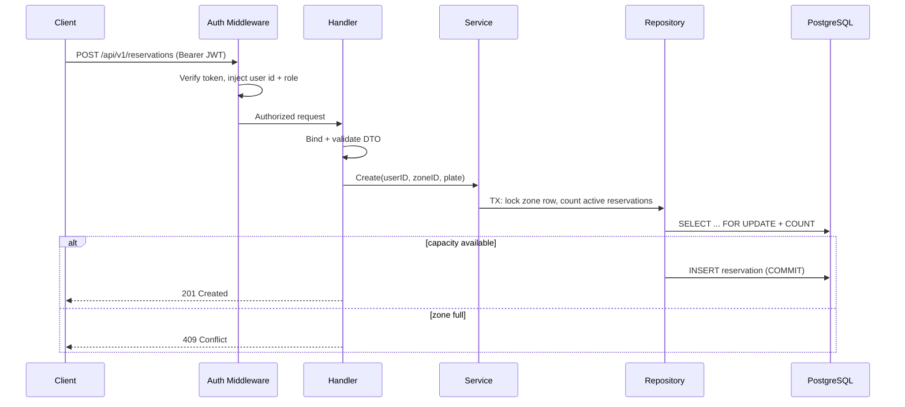

# SpotSync

> A high-concurrency reservation engine for finite parking and EV charging resources — built to **never oversell** a zone under contention.

[](https://go.dev)
[](./LICENSE)

- **Live API:** _pending Render deploy — see [Deployment](#deployment)_
- **API base path:** `/api/v1`

---

## Table of contents

- [Why SpotSync](#why-spotsync)
- [Features](#features)
- [Tech stack](#tech-stack)
- [Architecture](#architecture)
- [The concurrency problem](#the-concurrency-problem)
- [Project structure](#project-structure)
- [Getting started](#getting-started)
- [Configuration](#configuration)
- [API reference](#api-reference)
- [Testing](#testing)
- [Deployment](#deployment)
- [Roadmap](#roadmap)
- [License](#license)

---

## Why SpotSync

Parking and EV charging are **finite-capacity** resources in **high demand**. When many drivers race for the last EV spot at the same instant, a naive implementation lets two of them win — the zone ends up over capacity.

SpotSync treats that race as the central engineering problem. The reservation path is transactional and serializable per zone, so the capacity invariant — *active reservations ≤ total capacity* — holds no matter how many requests arrive concurrently.

---

## Features

- **JWT authentication** with bcrypt-hashed passwords (registration + login).
- **Role-based access control** — `driver` and `admin` roles enforced via middleware.
- **Parking zone management** — admins create zones (`general`, `ev_charging`, `covered`) with capacity and hourly pricing.
- **Dynamic availability** — `available_spots = total_capacity − active reservations`, computed on every read.
- **Concurrency-safe reservations** — database transaction + `SELECT … FOR UPDATE` on the zone row; over-capacity bookings return `409 Conflict`.
- **Ownership-scoped actions** — drivers cancel only their own reservations; admins list all reservations.
- **Consistent API contract** — `{success, message, data}` / `{success, message, errors}` envelope on every response.
- **Operational endpoints** — `/healthz`, `/readyz`, structured request logging, CORS, auth rate limiting.

---

## Tech stack

| Layer | Choice |
| --- | --- |
| Language | Go 1.25+ |
| HTTP | [Echo v4](https://echo.labstack.com/) |
| ORM | [GORM](https://gorm.io/) (PostgreSQL) |
| Database | PostgreSQL ([Neon](https://neon.tech/) in production) |
| Validation | go-playground/validator/v10 |
| Auth | golang-jwt/jwt/v5 + bcrypt |
| Migrations | golang-migrate (embedded SQL) |
| Deploy | [Render](https://render.com/) (Docker web service) |

---

## Architecture

SpotSync follows **Clean Architecture**. Dependencies point inward; handlers never touch GORM models directly — DTOs cross the wire, repositories own persistence, services own business rules and the capacity invariant. Wiring is manual dependency injection in `internal/app`.

```
┌──────────────────────────────────────────────────────────────┐
│  Handler     HTTP only — bind/validate DTOs, call services,  │
│              write JSON envelope responses.                   │
├──────────────────────────────────────────────────────────────┤
│  Middleware  JWT verification, RBAC, request ID, CORS,       │
│              rate limiting on /auth/*.                        │
├──────────────────────────────────────────────────────────────┤
│  Service     Business logic — auth, zones, capacity rules.   │
│              Orchestrates repositories; owns invariants.      │
├──────────────────────────────────────────────────────────────┤
│  Repository  GORM queries, transactions, row locks.           │
├──────────────────────────────────────────────────────────────┤
│  Models/DTO  GORM structs (DB) and request/response DTOs.    │
└──────────────────────────────────────────────────────────────┘
```

**Request lifecycle (reservation):**



### Data model

| Table | Key fields |
| --- | --- |
| `users` | `email` (unique), bcrypt `password`, `role` (`driver` \| `admin`) |
| `parking_zones` | `type`, `total_capacity`, `price_per_hour` |
| `reservations` | `user_id`, `zone_id`, `license_plate`, `status` (`active` \| `cancelled` \| `completed`) |

Availability is derived, not stored: `available_spots = total_capacity − count(active reservations)`.

---

## The concurrency problem

If `total_capacity` is 1 and one reservation is active, the next must be rejected. Two simultaneous requests can both read "0 active" and both succeed unless the check-and-insert is serialized.

SpotSync opens a transaction, locks the zone row (`FOR UPDATE`), counts active reservations, and inserts only when `active < total_capacity`. Concurrent reservers for the same zone queue behind the lock. A 50-goroutine stampede test asserts exactly one success on a single-spot zone.

---

## Project structure

```
cmd/api/              API entrypoint
cmd/seed/             Admin bootstrap seed
internal/
  app/                Echo wiring (manual DI)
  config/             Environment loading
  dto/                Request/response DTOs
  handler/            HTTP handlers
  service/            Business logic
  repository/         GORM data access
  models/             GORM structs
  domain/             Domain errors
  middleware/         JWT, RBAC, logging, CORS
  platform/           DB, JWT, migrations, logger
migrations/           Versioned SQL (embedded at runtime)
deploy/               Docker, Compose, Render blueprint
test/
  contract/           Graded API spec replay
  integration/        testcontainers + race tests
```

---

## Getting started

### Prerequisites

- Go 1.25+
- PostgreSQL 15+ (or Docker)
- Optional: golang-migrate CLI, air, golangci-lint, Docker

### Local setup

```bash
git clone https://github.com/rayeemomayeer/SpotSync.git
cd SpotSync
cp .env.example .env
make compose-up    # Postgres on :5432
make migrate-up    # if not using MIGRATE_ON_STARTUP
make run
```

Verify:

```bash
curl http://localhost:8080/healthz
curl http://localhost:8080/readyz
```

### Docker Compose (API + Postgres)

```bash
docker compose -f deploy/compose/docker-compose.yml up --build
```

The API listens on `http://localhost:8080` with migrations applied on startup.

---

## Configuration

| Variable | Required | Default | Description |
| --- | --- | --- | --- |
| `DATABASE_URL` | yes | — | PostgreSQL connection string |
| `JWT_SECRET` | yes | — | JWT signing secret |
| `PORT` | no | `8080` | HTTP port |
| `JWT_EXPIRY` | no | `24h` | Token lifetime |
| `BCRYPT_COST` | no | `12` | bcrypt cost (10–14) |
| `ALLOW_SELF_ADMIN_REGISTRATION` | no | `true` | Honor `admin` role on register |
| `CORS_ALLOWED_ORIGINS` | no | — | Comma-separated origins |
| `MIGRATE_ON_STARTUP` | no | `true` | Run embedded migrations on boot |
| `LOG_LEVEL` | no | `info` | Log verbosity |
| `DB_MAX_OPEN_CONNS` | no | `25` | Connection pool size |
| `DB_MAX_IDLE_CONNS` | no | `5` | Idle connections |
| `DB_CONN_MAX_LIFETIME` | no | `5m` | Max connection lifetime |

Create a production admin with `make seed` when `ALLOW_SELF_ADMIN_REGISTRATION=false`.

---

## API reference

Base path: `/api/v1`. All responses use a consistent envelope.

**Success:** `{ "success": true, "message": "…", "data": … }`  
**Error:** `{ "success": false, "message": "…", "errors": { "field": "…" } }`

| # | Method | Endpoint | Access | Description |
| --- | --- | --- | --- | --- |
| 1 | POST | `/auth/register` | Public | Register (`201`) |
| 2 | POST | `/auth/login` | Public | Login → token + user (`200`) |
| 3 | POST | `/zones` | Admin | Create zone (`201`) |
| 4 | GET | `/zones` | Public | List zones with `available_spots` |
| 5 | GET | `/zones/:id` | Public | Get one zone |
| 6 | POST | `/reservations` | Auth | Reserve a spot (`201` / `409`) |
| 7 | GET | `/reservations/my-reservations` | Auth | List caller's reservations |
| 8 | DELETE | `/reservations/:id` | Auth | Cancel own reservation (`403` if not owner) |
| 9 | GET | `/reservations` | Admin | List all (optional `?page` & `?limit`) |

### Examples

**Register**

```http
POST /api/v1/auth/register
Content-Type: application/json

{ "name": "Jane Doe", "email": "jane@example.com", "password": "password123", "role": "driver" }
```

**Login**

```http
POST /api/v1/auth/login
Content-Type: application/json

{ "email": "jane@example.com", "password": "password123" }
```

Response `data` contains `token` and `user`. Send `Authorization: Bearer <token>` on protected routes.

**Reserve**

```http
POST /api/v1/reservations
Authorization: Bearer <token>
Content-Type: application/json

{ "zone_id": 1, "license_plate": "ABC-1234" }
```

### Status codes

| Code | Meaning |
| --- | --- |
| 200 | Success (GET, DELETE) |
| 201 | Created |
| 400 | Validation error |
| 401 | Missing or invalid token |
| 403 | Forbidden (role or ownership) |
| 404 | Not found |
| 409 | Conflict (zone full, duplicate email) |
| 500 | Server error |

---

## Testing

```bash
make test            # unit tests
make test-race       # race detector (Linux/macOS with CGO)
make test-int        # integration (requires Docker)
make test-contract   # graded API replay (requires Docker)
```

The contract suite replays all nine endpoints against a real Postgres instance. The stampede test fires 50 concurrent reservations at a 1-capacity zone and asserts exactly one success.

---

## Deployment

Production stack: **Neon** (Postgres) + **Render** (API).

### Render MCP (Cursor)

SpotSync is configured to use Render's hosted MCP server so you can manage deploys from Cursor.

1. Create an API key at [Render Account Settings → API Keys](https://dashboard.render.com/u/settings#api-keys).
2. Set it as a **user environment variable** (Windows: Settings → System → Environment variables):
   ```
   RENDER_API_KEY=your-key-here
   ```
3. **Restart Cursor** so it picks up the MCP config (`~/.cursor/mcp.json` and `.cursor/mcp.json` in this repo).
4. In Cursor chat, run: `Set my Render workspace to [YOUR_WORKSPACE]`
5. Then prompt: _"Deploy SpotSync from this repo using render.yaml"_ or _"List my Render services"_.

MCP endpoint: `https://mcp.render.com/mcp`

### Option A — Blueprint (recommended)

1. Push this repo to GitHub.
2. In [Render Dashboard](https://dashboard.render.com/) → **New** → **Blueprint**.
3. Connect `rayeemomayeer/SpotSync` — Render reads `render.yaml` at the repo root.
4. When prompted, set secrets:
   - `DATABASE_URL` — your Neon pooled connection string (`sslmode=require`)
   - `JWT_SECRET` — a long random string
5. Deploy. Migrations run on startup (`MIGRATE_ON_STARTUP=true`).

Verify:

```bash
curl https://spotsync.onrender.com/healthz
curl https://spotsync.onrender.com/readyz
```

Update the **Live API** link at the top of this README with your Render URL (e.g. `https://spotsync.onrender.com`).

### Option B — Manual web service

1. **New → Web Service** → connect this GitHub repo.
2. **Runtime:** Docker · **Dockerfile path:** `deploy/docker/Dockerfile`
3. **Health check path:** `/healthz`
4. Add environment variables from [Configuration](#configuration) (`DATABASE_URL`, `JWT_SECRET`, etc.).
5. Create web service and deploy.

### Neon database

If you don't have Postgres yet:

1. Create a project at [neon.tech](https://neon.tech/).
2. Copy the **pooled** connection string with `sslmode=require`.
3. Set it as `DATABASE_URL` on Render (not in git).

### CORS

Set `CORS_ALLOWED_ORIGINS` on Render to your frontend origin(s), comma-separated.

---

## Roadmap

- [x] **Phase 0 — Graded baseline** — auth, RBAC, zones, concurrency-safe reservations, contract tests.
- [ ] **Phase 1 — Event-driven** — transactional outbox, worker, time-bounded expiry.
- [ ] **Phase 2 — Real-time** — Redis cache, SSE availability stream.
- [ ] **Phase 3 — Distributed** — pluggable capacity strategies, Nginx multi-replica.
- [ ] **Phase 4 — Observability** — Prometheus, Grafana, k6 load tests.
- [ ] **Phase 5 — Kubernetes** — kind cluster, HPA, ingress.

---

## License

MIT — see [LICENSE](./LICENSE).
